# MyCloud 2.0

This is an upgraded version of [MyCloud 1.0](https://github.com/TadeJin/MyCloud) using better coding practices and modern technologies.
The app is self-hosted on a Raspberry Pi and deployed at [mycld.cz](https://mycld.cz/).

## Tech stack
- **Next.js** — fullstack framework
- **React** + **TypeScript** — frontend
- **Tailwind CSS** — styling
- **PostgreSQL** + **Prisma**  — database & ORM
- **tRPC** + **Zod** — Typesafe API with schema validation
- **Better Auth** — authentication
- **Resend** — email sending
- **Docker** — containerized deployment
- **Upstash** — rate limiting

## Features
- Upload and manage files from any device
- Drag & Drop
- Responsive design — works seamlessly on desktop, tablet, and phone
- File search, folder system, file type filter
- 1GB free storage per user, unlimited storage for users with maxCapacity set as -1
- Authentication & session management
- Email notifications via Resend
- Settings page with account options (password/email change, account deletion)
- Password reset via email
- File preview — images, videos, and PDFs

## Screenshots

| | Light | Dark |
|---|---|---|
| Login | 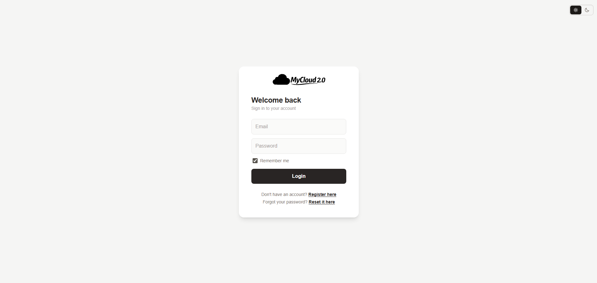 | 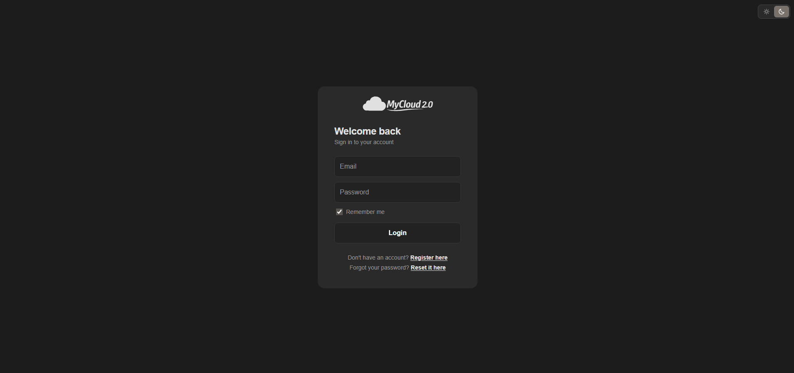 |
| Storage | 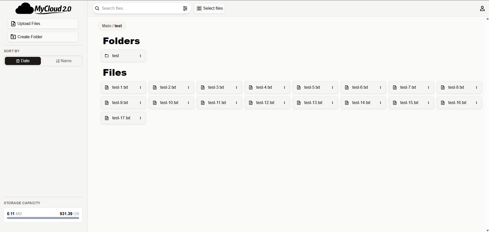 | 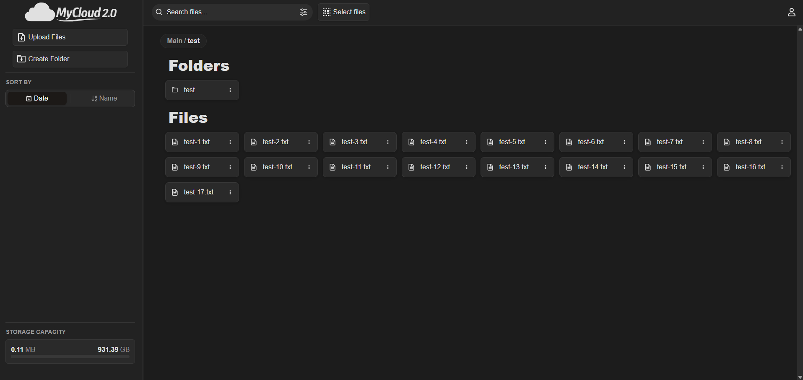 |
| Upload | 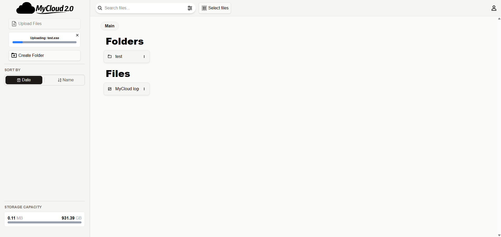 | 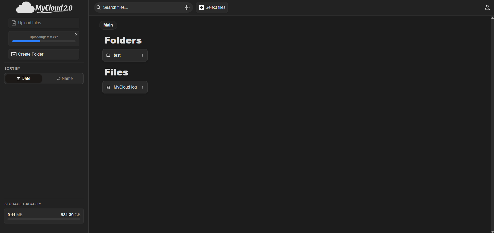 |
| Drag & Drop | 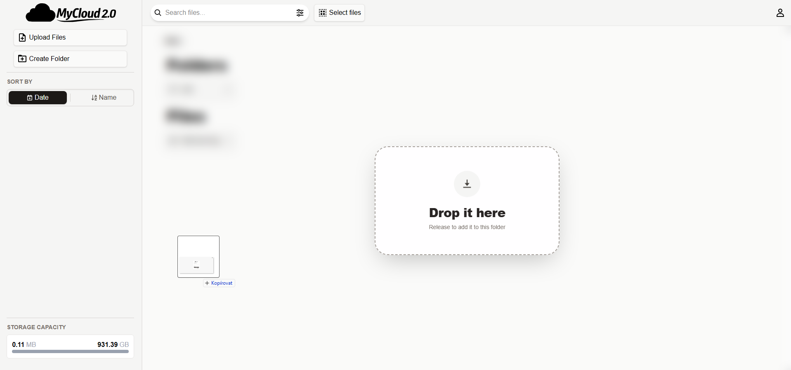 | 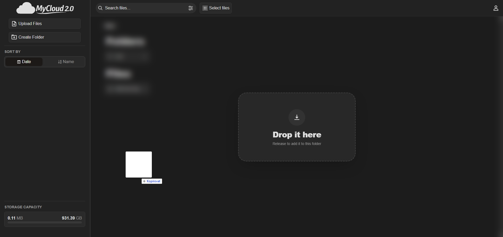 |
| File Preview | 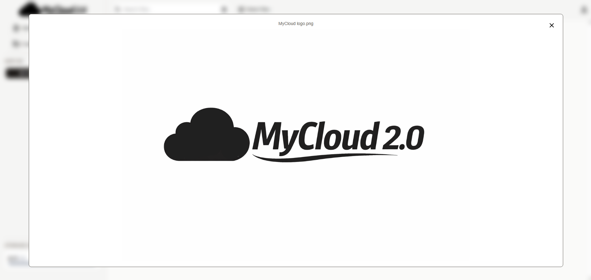 | 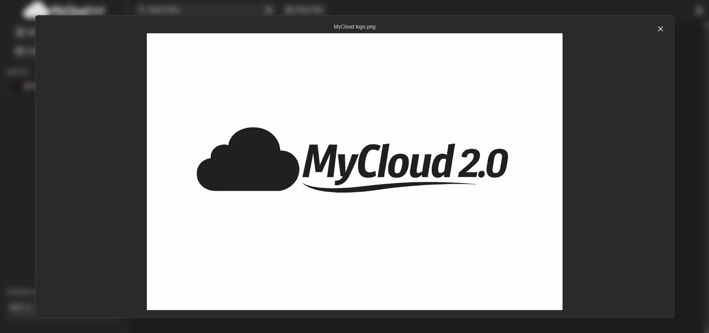 |
| Settings | 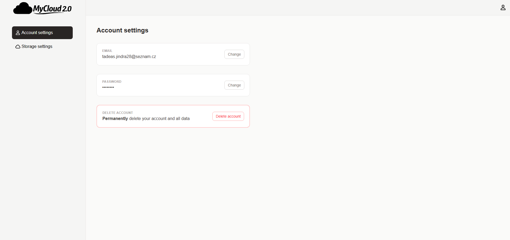 | 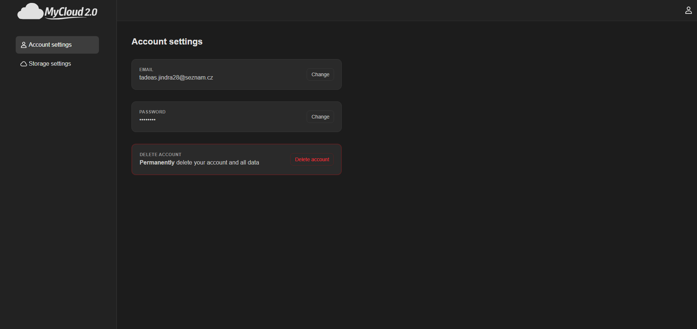 |

## Getting started
1. Create a `.env` file:
```env
DATABASE_URL=                # connection string to your database
FILE_STORAGE_PATH=/storage   # can also be set in docker-compose.yml
BETTER_AUTH_SECRET=          # random secret — generate with: openssl rand -base64 32
BETTER_AUTH_URL=             # your app's base URL e.g. http://localhost:3000
RESEND_API_KEY=              # from resend.com dashboard
SITE_DOMAIN=                 # base URL used in email links
UPSTASH_URL=                 # from upstash.com
UPSTASH_TOKEN=               # from upstash.com
```
2. Set the storage path in `docker-compose.yml` and run `docker compose up --build` in root directory
